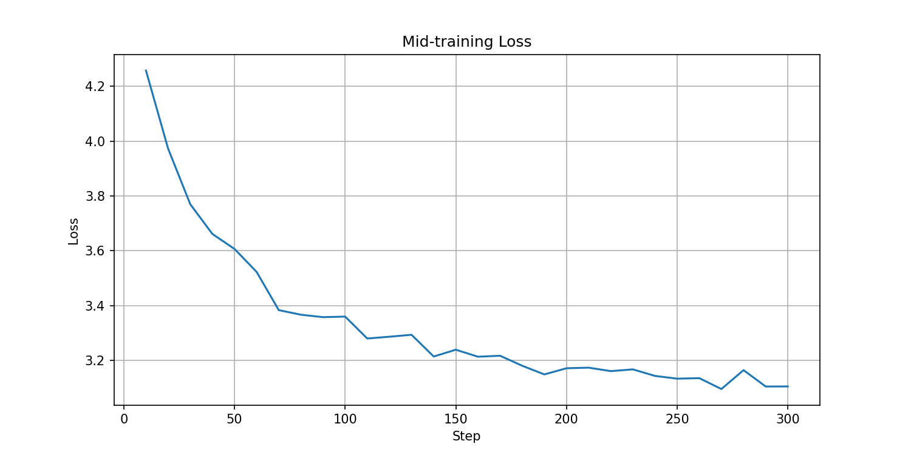
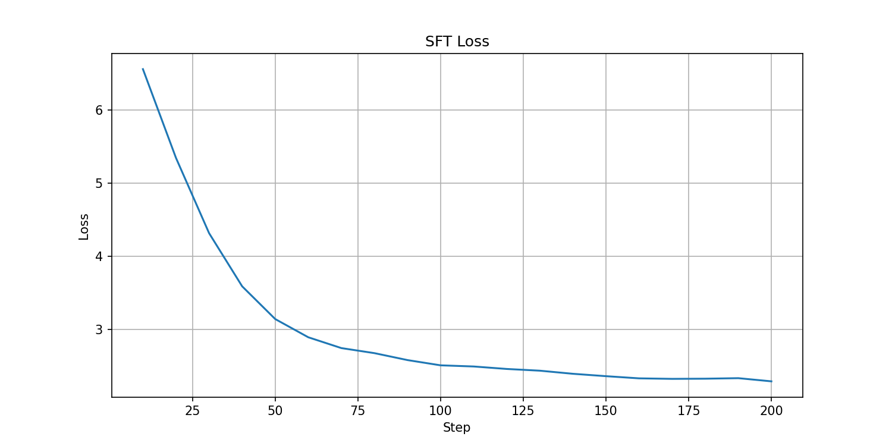

# SLM — Small Language Model

Transformer decoder-only treinado do zero no dataset FineWeb-Edu.  
Trabalho 2 — Deep Learning II — PUCRS 2026/1.

| Etapa | Modelo publicado |
|---|---|
| Pré-treino | [ldsv29/slm-pretrained](https://huggingface.co/ldsv29/slm-pretrained) |
| Mid-Training | [ldsv29/slm-midtraining](https://huggingface.co/ldsv29/slm-midtraining) |
| SFT | [ldsv29/slm-sft](https://huggingface.co/ldsv29/slm-sft) |

---

## Arquitetura

| Componente | Escolha | Motivo |
|---|---|---|
| Base | `LlamaForCausalLM` | Implementações prontas de RoPE, GQA, SwiGLU e RMSNorm |
| Positional Encoding | RoPE (`rope_theta=10000`) | Codifica posição relativa; melhor generalização que sinusoidal/learned |
| Atenção | GQA (12Q / 4KV heads) | Reduz KV-cache 3× sem perda significativa de qualidade |
| Ativação | SwiGLU | GLU com gate aprendido; supera GELU/ReLU em escala |
| Normalização | RMSNorm pre-norm | Mais rápido que LayerNorm; pre-norm estabiliza gradientes em redes fundas |
| Otimizador | AdamW + cosine LR | Padrão para pré-treino de LLMs; weight decay desacoplado corretamente |
| Tokenizer | GPT-2 BPE via tiktoken | Vocabulário estável para inglês; tiktoken é ~5× mais rápido |

### Hiperparâmetros do modelo

| Parâmetro | Valor |
|---|---|
| `vocab_size` | 50304 (múltiplo de 64 para eficiência CUDA) |
| `hidden_size` | 768 |
| `num_hidden_layers` | 10 |
| `num_attention_heads` | 12 |
| `num_key_value_heads` | 4 |
| `intermediate_size` | 2048 |
| `max_position_embeddings` | 1024 |
| Parâmetros treináveis | ~101.5M (com weight tying) |

### Tamanho do dataset — Chinchilla Scaling Law

O número de tokens consumidos no treino é calculado pelos hiperparâmetros:

```
batch_por_GPU × grad_accum × nº_GPUs × seq_len × max_steps
     16        ×     16     ×    2    ×  1024   ×   7630   ≈ 4B tokens
```

A Chinchilla Scaling Law estabelece que o número ótimo de tokens é **~20× o número de parâmetros**:

```
101.564.160 params × 20 ≈ 2B tokens
```

Treinamos com **~4B tokens**, ou seja, **2× o ótimo Chinchilla**. Isso segue a estratégia
do **LLaMA 1** (Touvron et al., 2023): para modelos usados em inferência, vale ultrapassar
o ótimo Chinchilla — um modelo menor treinado por mais tempo é mais eficiente em inferência
do que um modelo maior treinado pelo mínimo ótimo, sem aumento no custo de uso.

---

## Estrutura do projeto

```
.
├── config.py                  # Arquitetura: SLMConfig + SLMModel
├── dataset_streaming.py       # Dataset FineWeb-Edu com streaming (pré-treino)
├── dataset_midtraining.py     # SmolTalk + GSM8K com streaming (mid-training)
├── dataset_sft.py             # SmolTalk com loss mask (SFT)
├── train.py                   # Pré-treino com HuggingFace Trainer
├── midtraining.py             # Mid-training a partir do slm-pretrained
├── sft.py                     # SFT a partir do slm-midtraining
├── evaluate_perplexity.py     # Perplexidade nas 3 etapas
├── evaluate_benchmark.py      # HellaSwag accuracy nas 3 etapas
├── app.py                     # Demo chat com Streamlit
├── smoke_test.py              # Sanity check local
├── plot_loss.py               # Plota curva de loss
├── job_train.sh               # Script SLURM — pré-treino
├── job_midtrain.sh            # Script SLURM — mid-training
├── job_sft.sh                 # Script SLURM — SFT
└── requirements.txt           # Dependências Python
```

> Os checkpoints não estão versionados no git. Os modelos treinados estão publicados no HuggingFace Hub (links no topo).

---

## Instalação

### Requisitos

- Python 3.10+
- CUDA 12.1 (para treino com GPU)

### Criar ambiente virtual e instalar dependências

```bash
python3 -m venv .venv
source .venv/bin/activate          # Linux/macOS
# ou: .venv\Scripts\activate       # Windows

pip install --upgrade pip
pip install torch==2.4.0 --index-url https://download.pytorch.org/whl/cu121
pip install -r requirements.txt
```

### Variáveis de ambiente

Crie um arquivo `.env` na raiz do projeto:

```
HUGGINFACE_TOKEN=hf_seu_token_aqui
```

O token é necessário para push de checkpoints durante o treino e para download do modelo.  
Obtenha em: [huggingface.co/settings/tokens](https://huggingface.co/settings/tokens)

---

## Pipeline de Treino

### Etapa 1 — Pré-treino

Dataset FineWeb-Edu com streaming. Submeta o job no cluster:

```bash
sbatch job_train.sh
```

| Parâmetro | Valor |
|---|---|
| `per_device_train_batch_size` | 16 |
| `gradient_accumulation_steps` | 16 |
| Batch efetivo (2 GPUs) | 524.288 tokens |
| `max_steps` | 7630 |
| `learning_rate` | 3e-4 |
| `warmup_steps` | 200 |
| Hardware | 2× RTX A5000 24GB |
| Loss final | ~5.0 |

---

### Etapa 2 — Mid-Training

Fine-tuning sobre `ldsv29/slm-pretrained` com SmolTalk + GSM8K em formato chat.

```bash
sbatch job_midtrain.sh
```

| Parâmetro | Valor |
|---|---|
| `max_steps` | 300 |
| `learning_rate` | 1e-4 |
| Loss final | ~3.1 |

---

### Etapa 3 — SFT (Supervised Fine-Tuning)

Fine-tuning sobre `ldsv29/slm-midtraining` com SmolTalk usando loss mask nos tokens do usuário — o modelo aprende apenas a gerar as respostas do assistant.

```bash
sbatch job_sft.sh
```

| Parâmetro | Valor |
|---|---|
| `max_steps` | 500 |
| `learning_rate` | 2e-5 |
| Loss final | ~2.2 |

#### Retomar de checkpoint

Se o job for interrompido, passe o checkpoint para o Trainer:

```python
trainer.train(resume_from_checkpoint="checkpoints_sft/checkpoint-200")
```

---

## Avaliação

### Perplexidade

Medida sobre FineWeb-Edu (texto bruto). Menor = melhor.

```bash
python evaluate_perplexity.py
```

| Etapa | Perplexidade |
|---|---|
| Pré-treino | 150.32 |
| Mid-Training | 192.03 |
| SFT | 2178.94 |

*O aumento pós-SFT é um artefato de distribuição: o modelo passou a esperar formato chat (`<|im_start|>user...`), tornando PPL em texto bruto uma métrica inadequada para essa etapa.

### HellaSwag (Benchmark)

Commonsense reasoning — escolha da continuação mais provável entre 4 opções via log-prob scoring. Baseline aleatório = 25%.

```bash
python evaluate_benchmark.py
```

| Etapa | Acurácia |
|---|---|
| Pré-treino | 28% |
| Mid-Training | 30% |
| SFT | **34%** (acima do GPT-2 117M ~31–33%) |

---

## Demo — Interface Chat

```bash
pip install streamlit
streamlit run app.py
```

Interface Streamlit com sidebar de parâmetros ajustáveis: temperature, top-k, top-p e max new tokens. O histórico completo da conversa é concatenado no prompt a cada turno (contexto de até 1024 tokens).

---

## Curvas de Loss

**Pré-treino:**


**Mid-Training:**


**SFT:**

