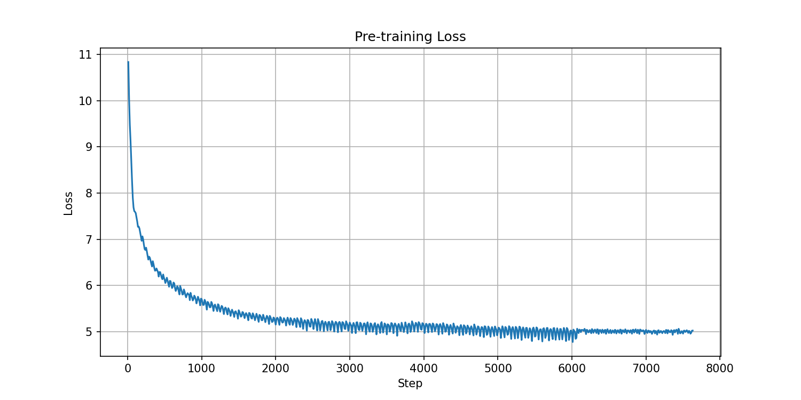

# SLM — Small Language Model (Pré-treino)

Transformer decoder-only treinado do zero no dataset FineWeb-Edu.  
Trabalho 2 — Deep Learning II — PUCRS 2026/1.

**Modelo publicado:** [ldsv29/slm-pretrained](https://huggingface.co/ldsv29/slm-pretrained)

---

## Arquitetura

| Componente | Escolha | Motivo |
|---|---|---|
| Base | `LlamaForCausalLM` | Implementações prontas de RoPE, GQA, SwiGLU e RMSNorm |
| Positional Encoding | RoPE (`rope_theta=10000`) | Codifica posição relativa; melhor generalização que sinusoidal/learned |
| Atenção | GQA (12Q / 4KV heads) | Reduz KV-cache 3× sem perda significativa de qualidade |
| Ativação | SwiGLU | GLU com gate aprendido; supera GELU/ReLU em escala |
| Normalização | RMSNorm pre-norm | Mais rápido que LayerNorm; pre-norm estabiliza gradientes em redes fundas |
| Otimizador | AdamW + cosine LR | Padrão para pré-treino de LLMs; weight decay desacoplado corretamente |
| Tokenizer | GPT-2 BPE via tiktoken | Vocabulário estável para inglês; tiktoken é ~5× mais rápido |

### Hiperparâmetros do modelo

| Parâmetro | Valor |
|---|---|
| `vocab_size` | 50304 (múltiplo de 64 para eficiência CUDA) |
| `hidden_size` | 768 |
| `num_hidden_layers` | 10 |
| `num_attention_heads` | 12 |
| `num_key_value_heads` | 4 |
| `intermediate_size` | 2048 |
| `max_position_embeddings` | 1024 |
| Parâmetros treináveis | ~101.5M (com weight tying) |

### Scaling Law (Chinchilla)

101.5M params × 20 ≈ **2B tokens** de treinamento ótimo.  
Este experimento usa o subconjunto `sample-10BT` do FineWeb-Edu com 7630 steps
(~2B tokens com batch efetivo de 262.144 tokens/step).

---

## Estrutura do projeto

```
.
├── config.py              # Arquitetura: SLMConfig + SLMModel
├── dataset_streaming.py   # Dataset FineWeb-Edu com streaming
├── train.py               # Loop de treino com HuggingFace Trainer
├── smoke_test.py          # Sanity check local (CPU, sem dados reais)
├── generator.py           # Geração de texto a partir de checkpoint
├── model_download.py      # Download do modelo do HuggingFace Hub
├── plot_loss.py           # Plota curva de loss do trainer_state.json
├── job_train.sh           # Script SLURM para execução no cluster
├── requirements.txt       # Dependências Python
└── loss_curve.png         # Curva de loss gerada após o treino
```

---

## Instalação

### Requisitos

- Python 3.10+
- CUDA 12.1 (para treino com GPU)

### Criar ambiente virtual e instalar dependências

```bash
python3 -m venv .venv
source .venv/bin/activate          # Linux/macOS
# ou: .venv\Scripts\activate       # Windows

pip install --upgrade pip
pip install torch==2.4.0 --index-url https://download.pytorch.org/whl/cu121
pip install -r requirements.txt
```

### Variáveis de ambiente

Crie um arquivo `.env` na raiz do projeto:

```
HUGGINFACE_TOKEN=hf_seu_token_aqui
```

O token é necessário para push de checkpoints durante o treino e para download do modelo.  
Obtenha em: [huggingface.co/settings/tokens](https://huggingface.co/settings/tokens)

Para autenticar no CLI:

```bash
hf auth login
```

---

## Execução

### 1. Smoke test (sanidade local, sem GPU)

Verifica se o modelo e o trainer funcionam corretamente com dados sintéticos em CPU.

```bash
python smoke_test.py
```

Esperado: loss caindo de ~10 para ~0 em 200 steps. Duração: ~30 minutos em CPU.

---

### 2. Pré-treino no cluster (SLURM)

No servidor, configure o ambiente da mesma forma que localmente: clone o repositório,
crie e ative a venv, instale as dependências do `requirements.txt` e configure o `.env`
com o token do HuggingFace. Em seguida, submeta o job:

```bash
sbatch job_train.sh
```

O script usa `torchrun` com 2 GPUs e o Trainer faz push automático de checkpoints
para o HuggingFace Hub a cada 500 steps (`hub_strategy="checkpoint"`).

#### Retomar de checkpoint

Se o job for interrompido, edite `train.py` e passe o checkpoint para o Trainer:

```python
trainer.train(resume_from_checkpoint=True)
```

O Trainer detecta automaticamente o último checkpoint salvo em `checkpoints/`.

---

### 3. Download do modelo treinado

Baixa o modelo publicado do HuggingFace Hub para a pasta `checkpoints/`:

```bash
python model_download.py
```

Requer `HUGGINFACE_TOKEN` no `.env`.

---

### 4. Geração de texto

Gera texto a partir de prompts usando o checkpoint local:

```bash
python generator.py
```

O script carrega `checkpoints/checkpoint-7630`, tokeniza os prompts com o tokenizer
do GPT-2 e gera até 100 novos tokens com `temperature=0.8` e `top_k=50`.

---

### 5. Plotar curva de loss

Após o treino, gera o gráfico `loss_curve.png` a partir dos logs do Trainer:

```bash
python plot_loss.py
```

Lê `checkpoints/last-checkpoint/trainer_state.json` e salva o gráfico na raiz do projeto.



---

## Configuração de treino

| Parâmetro | Valor |
|---|---|
| `per_device_train_batch_size` | 16 |
| `gradient_accumulation_steps` | 16 |
| Batch efetivo (2 GPUs) | 16 × 16 × 2 = 512 sequências = 524.288 tokens |
| `max_steps` | 7630 |
| `learning_rate` | 3e-4 |
| `lr_scheduler_type` | cosine |
| `warmup_steps` | 200 |
| `weight_decay` | 0.1 |
| `bf16` | True |
| Hardware | 2× RTX A5000 24GB |
| Loss final | ~5.0 |
